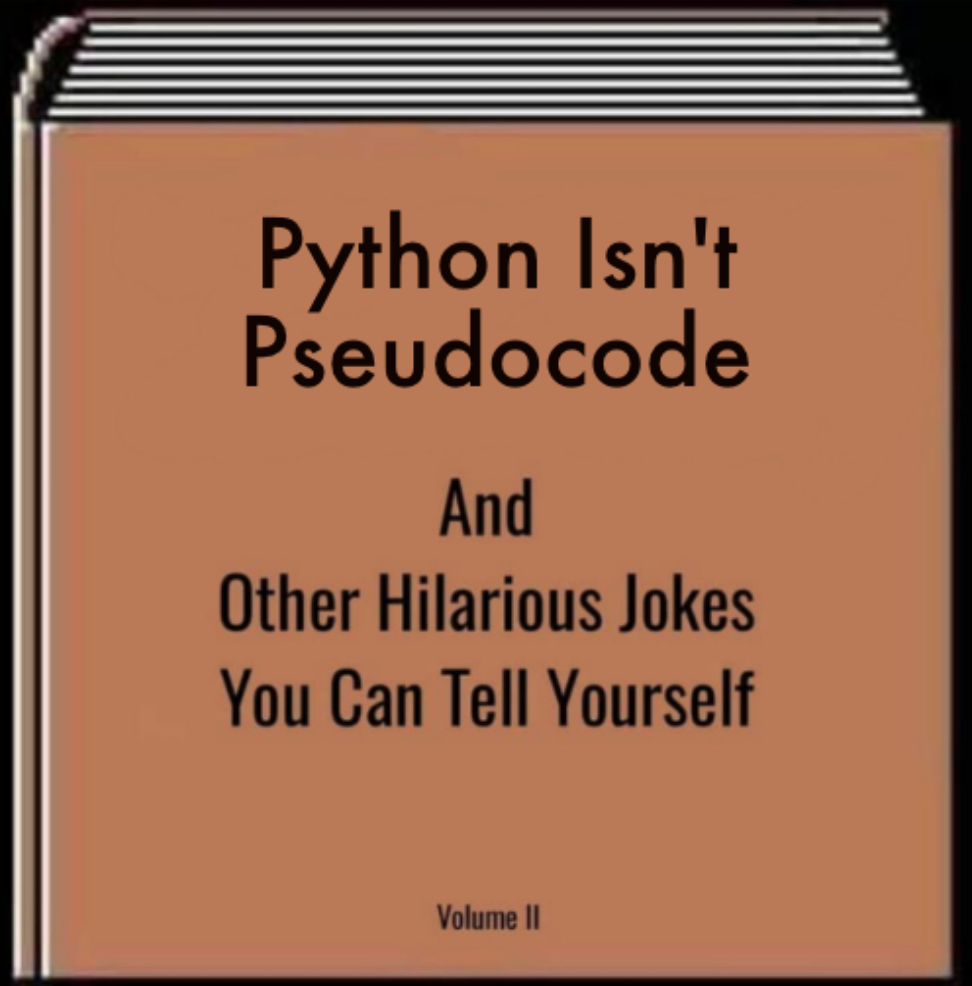

<h1 align="center">
  toboggan
   
  🛷
</h1>

A humble attempt to solve [Advent of Code 2020][aoc] problems.

## History

After completing Hacktoberfest for the second time (thanks Dev.to and Digital Ocean!), I was ready for more. I like HackerRank and solving small programming questions, but I have already completed a big chunk of easy questions. Medium ones need more commitment and quite often result in a bad mood and impostor syndrome.

As I found out, that there is [Advent of Code][aoc], I thought this might be it.

I decided to use Python, because it's "batteries included" and since I don't need third-party libraries, I wouldn't need to deal with `venv`.
This probably was a bit of a mistake. Scripting nature of the language started dominating my solutions, polluting the code with dirty hacks as the questions got more and more difficult. Starting from day 10 I started struggling with solutions and well-intended clean-codeness quickly disappeared.

## Other people

- [Sophie Alpert][alpert], one of the main contributors to React.js, is very high in the leaderboards
- The Primeagen streams his solutions on Twitch and posts his hilarious jokes, like [8 is equal to D][hilarious] to YouTube
- It was funny to see the mighty Uncle Bob [struggling with Dynamic Programming][uncle bob]
- [Jonathan Paulson][paulson] explained DP, which I couldn't understand by watching Uncle Bob
- Eric Wastl, the inventor of AoC, talking about his experiences [behind the scenes][wastl]

[aoc]: https://adventofcode.com
[alpert]: https://twitter.com/sophiebits
[hilarious]: https://youtu.be/SsGtfbnLI3s?t=89
[uncle bob]: https://www.youtube.com/watch?v=Ren_QQHM3iI
[paulson]: https://www.youtube.com/watch?v=cE88K2kFZn0
[wastl]: https://www.youtube.com/watch?v=CFWuwNDOnIo
